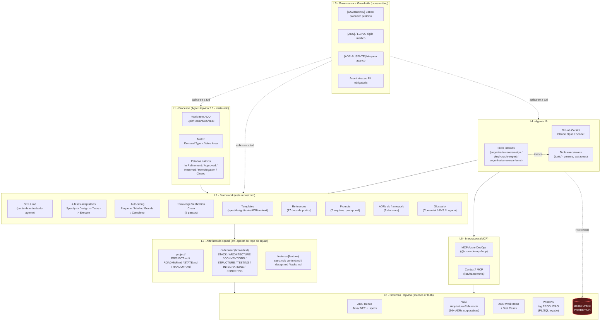
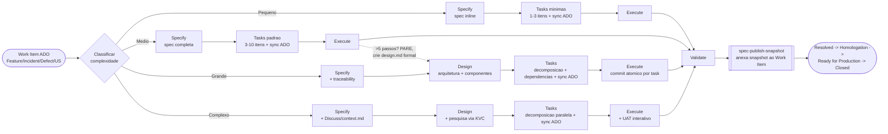
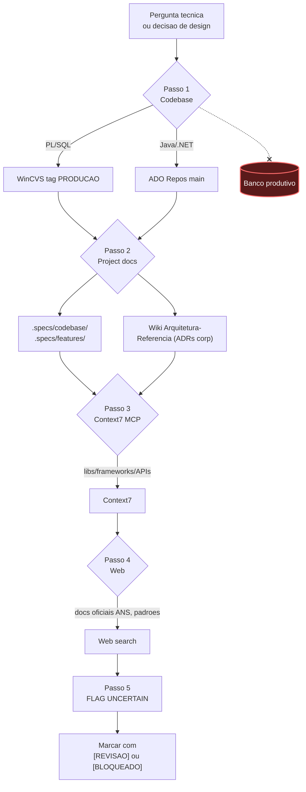
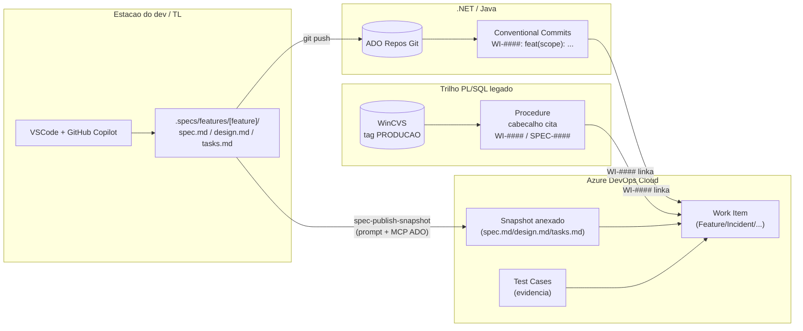
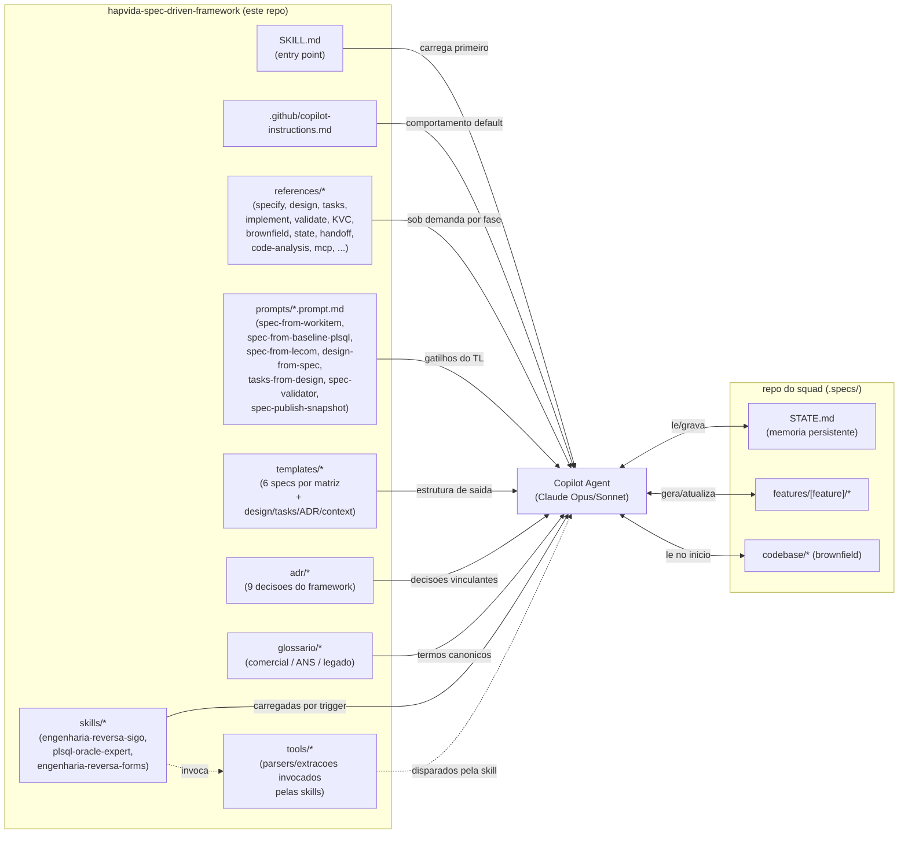
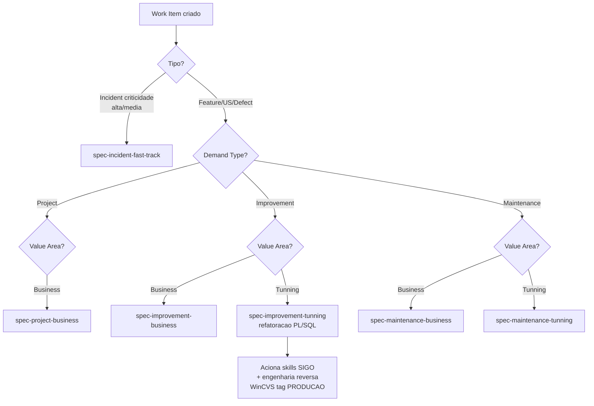

# Arquitetura do Framework Spec-Driven Hapvida

**Versao:** 0.2 (piloto Comercial)
**Status:** Documento descritivo - reflete o estado atual do repositorio
**Base:** TLC Spec-Driven 2.0 adaptado ao ecossistema Hapvida

> Este documento descreve a arquitetura logica do framework: como as pecas
> se relacionam, qual o fluxo de dados/artefatos, onde estao os pontos de
> integracao com o ecossistema Hapvida (ADO, WinCVS, Wiki, MCP) e onde
> ficam os guardrails inegociaveis (ANS, LGPD, banco produtivo).

---

## 1. Visao em uma frase

> Uma **camada fina, adaptativa e auditavel** sobre o Agile Hapvida 2.0,
> que coloca a **spec como artefato de primeira classe** versionado em Git,
> orquestrada por **GitHub Copilot + MCPs**, ancorada no **work item ADO**,
> respeitando **bi-VCS (WinCVS + ADO Repos)** e **regulacao ANS**.

---

## 2. Visao em camadas (logical layers)

**Leitura das camadas:**

- **L0** sao regras inegociaveis que permeiam tudo (nao sao etapas, sao filtros).
- **L1** e o processo corporativo existente - o framework **nao** modifica.
- **L2** e o conteudo deste repositorio: padroes, instrucoes e prompts.
- **L3** sao os artefatos vivos produzidos por squad, dentro do repo do squad.
- **L4** e o agente que orquestra o uso do framework (Copilot + skills).
- **L5** sao os MCPs que dao bracos ao agente para alcancar os sistemas reais.
- **L6** e a verdade absoluta - codigo e metadados que ja existem no Hapvida.

---

## 3. Fluxo das 4 fases adaptativas

**Regras essenciais:**

- **Specify, Tasks e Execute sao sempre obrigatorios.** Design e auto-skip por escopo.
- **Tasks sempre obrigatorio + sync ADO 1:1** ([REF: ADR-010](adr/010-tasks-obrigatorias-com-sync-ado.md)).
- **Discuss** so e disparado dentro de Specify para gray areas user-facing.
- **UAT interativo** so dentro de Execute, em features user-facing complexas.
- **Quick Mode** (atalho TLC) **fora do piloto** (ADR 008).
- **Valvula de seguranca:** se Tasks revelar >5 passos com dependencias complexas em escopo onde Design foi pulado, retroceder e criar `design.md` formal.

---

## 4. Knowledge Verification Chain (KVC) - filtro antes de afirmar

**Inegociaveis:**

- Nao pular para Passo 5 se Passos 1-4 sao acessiveis.
- Passo 5 nunca e apresentado como fato - sempre tokenizado.
- "Nao sei" e preferivel a inventar.

---

## 5. Bi-VCS + ancoragem no Work Item

A peca mais delicada: o framework **convive** com dois VCS diferentes, e
mantem o work item ADO como ponto unico de rastreabilidade.

**Pontos-chave:**

- A spec **vive em Git** (`.specs/features/[feature]/spec.md`).
- Quando a spec vai para `Approved`, um **snapshot** e anexado ao work item via prompt `spec-publish-snapshot` que aciona o MCP ADO.
- Em **PL/SQL**, a rastreabilidade volta para o work item pelo cabecalho da procedure (`WI-####`/`SPEC-####`).
- Em **Java/.NET**, pelos Conventional Commits com prefixo `WI-####:`.
- **Banco Oracle produtivo nao entra na cadeia.** Ponto.

---

## 6. Mapa de artefatos do framework -> consumo pelo agente

**Estrategia de carga de contexto (alvo <40k tokens):**

| Sempre | Sob demanda | Nunca simultaneo |
|---|---|---|
| `PROJECT.md`, `ROADMAP.md`, `STATE.md` | `codebase/*`, `CONCERNS.md`, `TESTING.md`, `spec.md` da feature em foco, `context.md`, `design.md`, `tasks.md` | Specs de multiplas features, multiplos docs de arquitetura, arquivados |

---

## 7. Selecao de template (matriz Demand Type x Value Area)

---

## 8. Componentes que ainda **nao** existem (escopo explicitamente fora da v0.2)

Para evitar leitura indevida do diagrama, estes itens **nao** estao na arquitetura atual:

- **Quick Mode** (atalho TLC) - ADR 008.
- **Pipelines ADO** de validacao automatizada de spec - validacao e local + Copilot + humano.
- **Automacao bidirecional com Lecom** alem de leitura como input.
- **Customizacao do processo Agile Hapvida 2.0** (211 projetos) - mantido default.
- **Refatoracao automatica de PL/SQL** pelo agente - Copilot **sugere**, humano decide.
- **Acesso a banco Oracle produtivo via MCP** - proibido permanentemente (ADR 007).

---

## 9. Pontos de extensao previstos (v0.3+)

- Glossario expandido para Autorizacao, Glosa, Mensalidade, Faturamento.
- Catalogo de specs canonicas anonimizadas.
- Materiais Onda 2 (devs e QAs).
- Possivel introducao de Quick Mode mediante feedback do piloto.

---

## 10. Resumo executivo

| Pilar | Decisao registrada |
|---|---|
| Spec como artefato de 1a classe versionado em Git | ADR 002 |
| Snapshot ao work item via MCP ADO | ADR 003 |
| Camada fina sobre Agile Hapvida 2.0 | ADR 004 |
| Conventional Commits + prefixo WI | ADR 005 |
| Knowledge Verification Chain | ADR 006 |
| Guardrail acesso producao | ADR 007 |
| Quick Mode fora do piloto | ADR 008 |
| STATE.md obrigatorio em projeto individual | ADR 009 |
| Adocao do framework | ADR 001 |

> Os diagramas acima sao a **leitura visual** dessas 9 decisoes combinadas
> com a estrutura concreta deste repositorio.
