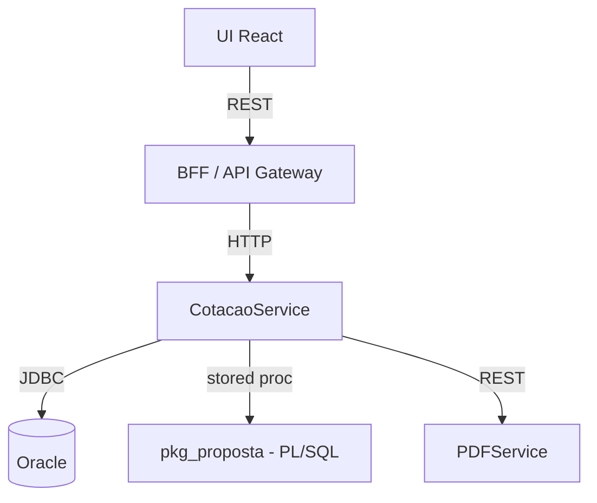

# Cotacao PME Design

**Spec:** `.specs/features/exemplo-cotacao-pme/spec.md`
**Status:** Draft
**Versao:** 0.1
**Data:** 2026-05-06

---

## Architecture Overview



---

## Code Reuse Analysis

### Componentes existentes a aproveitar

| Componente | Localizacao | Como usar |
|---|---|---|
| `pkg_proposta.calcula_mensalidade` | Banco corporativo (CVS PRODUCAO) | Stored procedure call para calculo |
| `BeneficiarioRepository` (existente) | `comercial-core` | Estender |
| `PDFService` corporativo | servico interno | Chamar via REST |
| Padrao Repositorio | `[REF: ADR-22]` | Aplicar ao novo `CotacaoRepository` |
| Estrutura BFF | `[REF: ADR-14]` | Seguir padrao |

### Pontos de integracao

| Sistema | Metodo |
|---|---|
| Entra ID | OAuth2 / Microsoft Identity Web |
| Banco Oracle | JDBC + stored procedure |
| PDFService | REST com auth corporativo |

---

## Components

### CotacaoController (REST)

- **Proposito:** receber requisicoes de cotacao, validar e delegar
- **Localizacao:** `comercial-bff/src/main/java/com/hapvida/comercial/cotacao/CotacaoController.java`
- **Stack:** Java Spring Boot
- **Interfaces:**
  - `POST /api/cotacoes` -> `CotacaoResponse`
  - `GET /api/cotacoes/{id}` -> `CotacaoResponse`
  - `GET /api/cotacoes/{id}/pdf` -> `application/pdf`
- **Dependencias:** CotacaoService
- **Reutiliza:** `[REF: ADR-14]` padrao APIs REST

### CotacaoService

- **Proposito:** orquestrar logica de cotacao
- **Localizacao:** `comercial-core/src/main/java/com/hapvida/comercial/cotacao/CotacaoService.java`
- **Stack:** Java
- **Interfaces:**
  - `gerar(GerarCotacaoCommand) -> Cotacao`
  - `recuperar(UUID id) -> Optional<Cotacao>`
- **Dependencias:** CotacaoRepository, PkgPropostaGateway, PdfGateway
- **Reutiliza:** Padrao Repositorio `[REF: ADR-22]`, padroes DDD `[REF: ADR-74]`

### PkgPropostaGateway

- **Proposito:** wrapper Java sobre `pkg_proposta.calcula_mensalidade`
- **Localizacao:** `comercial-core/src/main/java/com/hapvida/comercial/cotacao/gateway/PkgPropostaGateway.java`
- **Stack:** Java + JDBC
- **Interfaces:**
  - `calcular(List<Beneficiario>, Plano, LocalDate) -> ResultadoCotacao`
- **Dependencias:** DataSource Oracle
- **Reutiliza:** Padrao Gateway `[REF: ADR-22]` (anti-corruption layer ao codigo legado)

### CotacaoRepository

- **Proposito:** persistencia de cotacoes geradas
- **Localizacao:** `comercial-core/src/main/java/com/hapvida/comercial/cotacao/repository/`
- **Stack:** Java + Spring Data JPA
- **Reutiliza:** `[REF: ADR-22]`

### CotacaoUI (React)

- **Proposito:** interface do corretor
- **Localizacao:** `comercial-ui/src/features/cotacao/`
- **Stack:** React + TypeScript per `[REF: ADR-25]`

---

## Data Models

### Cotacao (Java)

```java
public record Cotacao(
    UUID id,
    String corretor,
    List<BeneficiarioCotacao> beneficiarios,
    Plano plano,
    LocalDate dataCotacao,
    LocalDate validadeAte,
    BigDecimal valorTotal,
    Map<UUID, BigDecimal> valoresPorBeneficiario,
    LocalDateTime criadoEm,
    StatusCotacao status
) {}
```

### tb_cotacao (Oracle)

```sql
-- tb_cotacao
ID_COTACAO          RAW(16)         PK
CD_CORRETOR         VARCHAR2(20)    NOT NULL
CD_PLANO            VARCHAR2(10)    NOT NULL
DT_COTACAO          DATE            NOT NULL
DT_VALIDADE         DATE            NOT NULL
VL_TOTAL            NUMBER(12,2)    NOT NULL
DS_STATUS           VARCHAR2(20)    NOT NULL
DT_CRIACAO          TIMESTAMP       NOT NULL
```

**Mapeamento legado:**

| Legado | Canonico (Java/glossario) |
|---|---|
| `CD_CORRETOR` | corretor |
| `DT_COTACAO` | dataCotacao |
| `DT_VALIDADE` | validadeAte |
| `VL_TOTAL` | valorTotal |

---

## Estrategia de tratamento de erros

| Cenario | Tratamento | Impacto no usuario |
|---|---|---|
| Beneficiario com CEP invalido (EC-01) | 400 com mensagem amigavel + sugestao | Mensagem inline no formulario |
| Plano nao disponivel para CEP (EC-02) | 422 + lista de planos alternativos | UI sugere planos |
| `pkg_proposta` retorna erro | 500 + log + retry transparente x1 | Mensagem generica + suporte |
| Mais de 99 vidas (EC-03) | 422 + indicar produto adequado | UI bloqueia avanco |

---

## Decisoes tecnicas

| Decisao | Escolha | Racional | ADR |
|---|---|---|---|
| Calculo de mensalidade | Reusar `pkg_proposta` | Reduz risco no MVP (AD-001 squad) | `[REF: AD-001 STATE.md]` |
| Persistencia | JPA (nao stored proc para CRUD) | Padrao para entidades novas | `[REF: ADR-22]` |
| UUID como ID | RAW(16) no Oracle, UUID no Java | Padrao de novos servicos | `[REF: ADR-XX]` se houver |
| Cache | Sem cache no MVP | AD-002 squad | `[REF: AD-002 STATE.md]` |

---

## ADRs aplicaveis

- `[REF: ADR-21]` - Linguagem Onipresente
- `[REF: ADR-22]` - Padrao Repositorio
- `[REF: ADR-14]` - Construcao de APIs REST
- `[REF: ADR-24]` - Linguagens e Frameworks Backend
- `[REF: ADR-25]` - Frameworks Frontend
- `[REF: ADR-74]` - Domain-Driven Design

---

## Pesquisa realizada (Knowledge Verification Chain)

| Topico | Step | Fonte | Confianca |
|---|---|---|---|
| `pkg_proposta` interface atual | Step 1 (CVS PRODUCAO) | `schema.pkg_proposta` linhas 145-280 | Alta |
| Padrao de gateway | Step 2 (ADR) | `[REF: ADR-22]` | Alta |
| Spring Data JPA com UUID em Oracle | Step 3 (Context7) | Spring Data docs | Alta |
| Conformidade RN 195/2009 | Step 4 (gov.br/ans) | `[ANS]` RN 195/2009 art. 2 | Media - Compliance review confirmara |
| Comportamento exato em EC-04 (idade >=60 sem dependente) | Step 5 | - | `[REVISAO]` exigida com Compliance |
