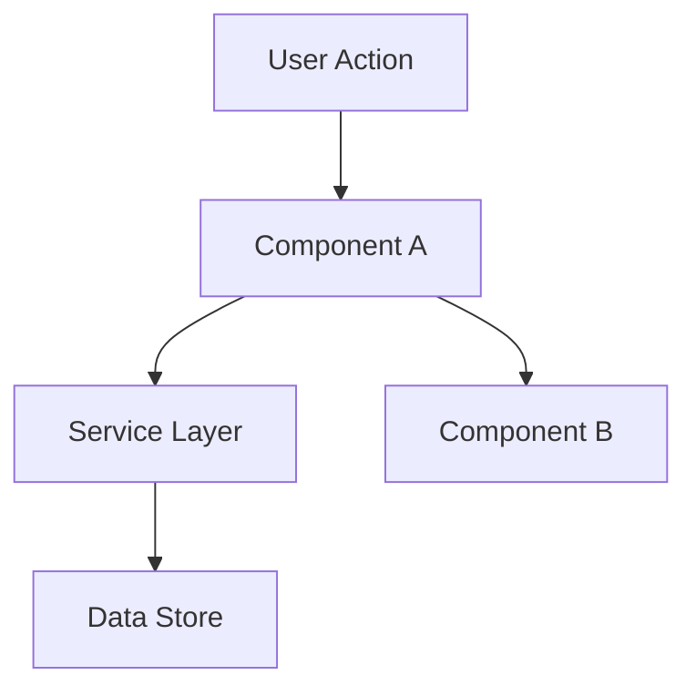

# Design

**Goal:** Definir COMO construir. Arquitetura, componentes, o que reutilizar.

**Pular esta fase quando:** A mudanca e direta - sem decisoes arquiteturais, sem novos padroes,
sem interacoes de componentes a planejar. Para features simples, design acontece inline durante
Execute.

## Adaptacoes Hapvida em relacao ao TLC original

| Item | TLC | Hapvida |
|---|---|---|
| Local | `.specs/[feature]/design.md` | Idem |
| Code Reuse Analysis | Generico | `[ADAPTACAO]` Para PL/SQL: extrair do baseline da tag `PRODUCAO`. Para Java/.NET: pesquisa em ADO Repos main |
| ADRs | Conceito generico | `[ADAPTACAO]` ADRs corporativas vivem na **wiki Arquitetura-Referencia** (>96 ADRs). Citar via `[REF: ADR-XX]` |
| Mermaid | TLC sugere | Mantido - mas como inline ou imagem versionada (mermaid-studio skill quando disponivel) |
| Research / Knowledge Verification Chain | TLC tem | `[ADAPTACAO]` Cadeia adaptada Hapvida (Codebase CVS PRODUCAO ou Git -> Project docs + ADRs wiki -> Context7 -> Web -> Flag) |

## Process

### 1. Carregar Contexto

Leia `.specs/features/[feature]/spec.md` antes de designar. Se `.specs/features/[feature]/context.md`
existe, carregue tambem - ele contem decisoes de implementacao que restringem o design (escolhas de
layout, preferencias de comportamento, padroes de interacao). Decisoes marcadas como "Agent's
Discretion" sao suas.

### 1.5. Pesquisa via Knowledge Verification Chain

Se a feature envolve tecnologia, padroes ou integracoes nao familiares, pesquise antes de designar.
Documente brevemente no doc de design ou como notas inline. Isso evita propagar suposicoes erradas
para tasks e implementacao.

Siga a cadeia em ordem estrita (ver [`knowledge-verification.md`](knowledge-verification.md)):

```
Codebase -> Project docs -> Context7 MCP -> Web search -> Flag uncertain
```

**CRITICO: NUNCA assuma ou fabrique informacao.** Se voce nao encontra resposta, diga explicitamente
"nao sei" ou "nao encontrei documentacao para isso". Inventar API, padrao ou comportamento que nao
existe e muito pior do que admitir incerteza. Marque com `[REVISAO]` ou `[BLOQUEADO]`.

Bons gatilhos para pesquisa: novas libraries, APIs nao familiares, features sensiveis a performance,
features sensiveis a seguranca, padroes que voce nao usou neste codebase antes.

### 2. Definir Arquitetura

Visao geral de como componentes interagem. Use diagramas mermaid quando ajudam.

### 3. Identificar Reutilizacao de Codigo

**CRITICO:** Que codigo existente podemos aproveitar? Isso poupa tokens e reduz erros.

Se `.specs/codebase/CONCERNS.md` existe, consulte antes de designar. Qualquer componente flagged
como fragil, com tech debt ou com gaps de cobertura de testes exige cuidado extra no design -
documente como o design mitiga essas preocupacoes.

Para PL/SQL: aproveite skills como `sigo-modernizacao-plsql` para extrair patterns reutilizaveis
do baseline da tag `PRODUCAO`.

Para Java/.NET: cite ADRs aplicaveis da wiki Arquitetura-Referencia (ADR 22 Padrao Repositorio,
ADR 14 APIs REST, ADR 18 Mensageria, etc).

### 4. Definir Componentes e Interfaces

Cada componente: Proposito, Localizacao, Interfaces, Dependencias, O que reutiliza.

### 5. Definir Modelos de Dados

Se a feature envolve dados, defina modelos antes de implementacao.

---

## Template: `.specs/[feature]/design.md`

```markdown
# [Feature] Design

**Spec:** `.specs/[feature]/spec.md`
**Status:** Draft | Approved
**Versao:** 0.1
**Data:** YYYY-MM-DD

---

## Architecture Overview

[Descricao breve da abordagem arquitetural]



---

## Code Reuse Analysis

### Componentes existentes a aproveitar

| Componente | Localizacao | Como usar |
|---|---|---|
| [Componente existente] | `src/path/to/file` ou `schema.package_x` | [Estender / Importar / Referenciar] |
| [Utilidade existente] | `src/utils/file` | [Como ajuda] |
| [Padrao existente] | `[REF: ADR-22]` | [Aplicar mesmo padrao] |

### Pontos de integracao

| Sistema | Metodo de integracao |
|---|---|
| [API existente] | [Como nova feature conecta] |
| [Banco de dados] | [Como dados conectam com schemas existentes] |
| [Service Now / Lecom / etc] | [Tipo de integracao] |

---

## Components

### [Component Name]

- **Proposito:** [O que esse componente faz - uma frase]
- **Localizacao:** `src/path/to/component/` ou `schema.procedure_y`
- **Stack:** PL/SQL | Java | .NET
- **Interfaces:**
  - `methodName(param: Type): ReturnType` - [descricao]
  - `methodName(param: Type): ReturnType` - [descricao]
- **Dependencias:** [O que precisa para funcionar]
- **Reutiliza:** [Codigo existente em que se apoia + ADRs]

### [Component Name]

[mesma estrutura]

---

## Data Models (se aplicavel)

### [Model Name]

```typescript
interface ModelName {
  id: string
  field1: string
  field2: number
  createdAt: Date
}
```

Para PL/SQL:

```sql
-- tb_model_name
-- Campos canonicos:
--   ID_MODEL          NUMBER(10)        PK
--   NM_FIELD1         VARCHAR2(100)
--   QT_FIELD2         NUMBER(10)
--   DT_CRIACAO        DATE
```

**Relacionamentos:** [Como isso se relaciona com outros modelos]

**Mapeamento legado:**

| Legado | Canonico |
|---|---|
| `BNF` | Beneficiario |
| `DT_VIG` | Vigencia |

---

## Estrategia de tratamento de erros

| Cenario de erro | Tratamento | Impacto no usuario |
|---|---|---|
| [Cenario 1] | [Como tratado] | [O que usuario ve] |
| [Cenario 2] | [Como tratado] | [O que usuario ve] |

---

## Decisoes tecnicas (so as nao-obvias)

| Decisao | Escolha | Racional | ADR |
|---|---|---|---|
| [O que decidimos] | [O que escolhemos] | [Por que - breve] | `[REF: ADR-XX]` ou `[ADR-AUSENTE]` |

---

## ADRs aplicaveis (citacoes)

- `[REF: ADR-21]` - Linguagem Onipresente (glossario)
- `[REF: ADR-74]` - Domain-Driven Design
- `[REF: ADR-22]` - Padrao Repositorio (se aplicavel)
- `[REF: ADR-14]` - Construcao de APIs REST (se aplicavel)

Se uma decisao arquitetural nao tem ADR aplicavel: `[ADR-AUSENTE]` - propor criacao antes de avancar.

---

## Pesquisa realizada (Knowledge Verification Chain)

| Topico | Step alcancado | Fonte | Confianca |
|---|---|---|---|
| [Item] | Codebase | `schema.proc_x` (PRODUCAO tag) | Alta |
| [Item] | Project docs | `[REF: ADR-22]` | Alta |
| [Item] | Context7 MCP | [framework/library] | Alta |
| [Item] | Web search | [URL oficial] | Media - validar com expert |
| [Item] | Flag uncertain | - | `[REVISAO]` exigida |
```

---

## Tips

- **Carregue contexto primeiro** - Se context.md existe, decisoes la sao locked
- **Pesquise quando incerto** - 5 minutos de pesquisa previne horas de retrabalho
- **Reuso e rei** - Cada componente deve referenciar padroes existentes
- **Interfaces primeiro** - Defina contratos antes de implementacao
- **Mantenha visual** - Diagramas economizam 1000 palavras
- **Componentes pequenos** - Se o componente faz 3+ coisas, divida
- **Cheque CONCERNS.md** - Se existe, flag areas frageis que o design deve enderecar
- **Confirme antes de Tasks** - Usuario aprova design antes de quebrar em tasks

---

## Adaptacoes especificas Hapvida

- Para refatoracao PL/SQL (Improvement+Tunning), o design.md inclui:
  - Tabela de mapeamento procedure legada -> componente refatorado
  - Marcadores `[MIGRACAO]` em pontos com `DBMS_*`, `UTL_*`, `BULK COLLECT`, tipos proprietarios
  - Citacao obrigatoria de ADR aplicavel (ADR 22 Repositorio, ADR 74 DDD, etc)
  - Conexao com skills SIGO se disponiveis no ambiente do dev

- Para feature regulatoria (qualquer Demand Type com `[ANS]`):
  - Secao especifica "Conformidade Regulatoria" antes da arquitetura
  - Listagem de articulos da Lei 9.656/98 e RNs aplicaveis
  - Decisoes de design que afetam regulacao requerem ADR aplicavel ou criacao de nova ADR

- Para spec hosted no work item ADO via snapshot:
  - O design.md fica em `.specs/features/[feature]/design.md` no Git
  - Quando feature atinge `Approved`, design.md tambem vira parte do snapshot anexado
  - Ver [`mcp-integration.md`](mcp-integration.md) para detalhes do snapshot
