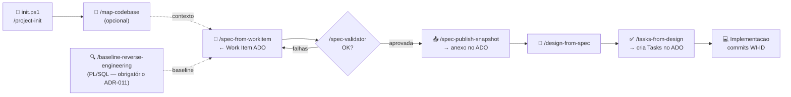

# Fluxo dos Prompts - Framework Spec-Driven Hapvida

**Versao:** v0.5.0
**Referencia:** SKILL.md, ADR-009, ADR-010, ADR-011, ADR-012

---

## Visao geral

Cada prompt command executa um conjunto fixo de passos e produz artefatos rastreados em
`.specs/`. O diagrama abaixo mostra o fluxo completo, da inicializacao do projeto ate o
fechamento da implementacao.

---

## Diagrama



### Entradas e saidas de cada etapa

```
[init.ps1]                    → .specs/project/  .vscode/  .github/  .gitmodules
      ↓
[/map-codebase]               → .specs/codebase/STACK.md + 6 outros docs
      ↓ (opcional)
[/baseline-reverse-engineering] → .specs/reverse-engineering/NOME/rev-TAG/reversa-NOME.md
      ↓ (PL/SQL apenas)
[/spec-from-workitem]         ← Work Item ADO (ID)
                              → .specs/features/WI-XXXX/spec.md
      ↓
[/spec-validator]             → checklist; repete até aprovacao
      ↓
[/spec-publish-snapshot]      → WI-XXXX-spec-vN.md anexado no ADO
      ↓
[/design-from-spec]           → .specs/features/WI-XXXX/design.md
      ↓
[/tasks-from-design]          → .specs/features/WI-XXXX/tasks.md
                              → 1 Task ADO criada por item via MCP
      ↓
[Implementacao]               → commits WI-TaskID: type(scope): desc
                              → PR → Homologacao → GMUD → Closed
```

---

## Descricao por prompt

### `/project-init` + `init.ps1`

Cria a estrutura inicial do repositorio do squad:

| Artefato criado | Obrigatorio |
|---|:---:|
| `.specs/project/STATE.md` | Sim (ADR-009) |
| `.specs/project/PROJECT.md` | Com `-WithProject` |
| `.specs/project/ROADMAP.md` | Com `-WithRoadmap` |
| `.specs/codebase/` | Com `-Brownfield` |
| `.specs/reverse-engineering/` | Com `-Brownfield -Stack PLSQL` |
| `.specs/framework/` (submodule) | Sim (ADR-012) |
| `.specs/.framework.json` | Sim (ADR-012) |
| `.vscode/mcp.json` | Sim |
| `.vscode/settings.json` | Sim |
| `.vscode/extensions.json` | Sim |
| `.github/copilot-instructions.md` | Sim |
| `.github/pull_request_template.md` | Sim |

---

### `/map-codebase`

Analisa o codigo fonte presente no workspace e gera os 7 documentos de mapeamento em
`.specs/codebase/`:

| # | Arquivo | Conteudo |
|---|---|---|
| 1 | `STACK.md` | Linguagens, frameworks, versoes |
| 2 | `ARCHITECTURE.md` | Componentes, fluxo de dados, dependencias |
| 3 | `STRUCTURE.md` | Layout de pastas, convencoes de naming |
| 4 | `CONVENTIONS.md` | Padroes de codigo, estilo, idiomas do time |
| 5 | `TESTING.md` | Frameworks, cobertura, gate check commands |
| 6 | `INTEGRATIONS.md` | ServiceNow, Lecom, GMUD, APIs externas |
| 7 | `CONCERNS.md` | Tech debt, areas frageis, ADRs ausentes |

> Opcional mas recomendado. Sem ele, o contexto e fornecido manualmente durante as conversas.

---

### `/baseline-reverse-engineering`

**Obrigatorio antes de qualquer spec de refatoracao PL/SQL (ADR-011).**

Passos executados:
1. Le o objeto via **CVS tag PRODUCAO** - se nao localizado: `[BLOQUEADO]` (sem fallback)
2. Invoca a skill `engenharia-reversa-sigo`
3. Materializa pre-requisitos em `.specs/codebase/knowledge-base/` se ausentes
4. Gera `.specs/reverse-engineering/plsql/<NOME>/v<VERSAO_CVS>-rev-NNN/reversa-<NOME>.md`
5. Atualiza `README-rotina.md` e catalogos

Guardrails ativos:
- `[GUARDRAIL]` MCP Oracle apenas para `dba_*` — `dba_source` proibido como fonte de codigo; nunca tabelas de negocio
- `[GUARDRAIL]` Codigo PL/SQL sempre via tag PRODUCAO do CVS

---

### `/spec-from-workitem`

Passos executados:
1. Le o work item via MCP ADO (`wit_get_work_items_by_id`)
2. Extrai titulo, descricao, Demand Type, Value Area, Acceptance Criteria, campos customizados
3. Determina o template pela matriz Demand Type x Value Area
4. Cria diretorio `.specs/features/WI-XXXX-<slug>/`
5. Gera `spec.md` com `[REVISAO]` nas lacunas que exigem input do TL
6. Aplica Knowledge Verification Chain (ADR-006)

---

### `/spec-validator`

Valida `spec.md` contra checklist completo:
- Frontmatter YAML (spec_id, work_item_id, demand_type, value_area, estado_spec, etc.)
- Conteudo (Problem Statement, Goals, Out of Scope, Regras, User Stories, AC, Edge Cases)
- Marcadores regulatorios (`[ANS]`, norma citada, `[ADR-AUSENTE]`)
- Knowledge Verification Chain presente e completa

Retorna lista de itens com falha. Repeticao ate aprovacao total.

---

### `/spec-publish-snapshot`

Executado quando spec atinge estado `Approved`. Passos:
1. Verifica pre-requisitos (work item = Approved, spec merged em main, sem PII)
2. Gera snapshot consolidado `WI-<id>-spec-vN.md` (spec + design + tasks + context)
3. Faz upload como attachment no work item ADO via MCP
4. Adiciona comentario com hash SHA-256 do conteudo e caminho Git

---

### `/design-from-spec`

Passos executados:
1. Le `spec.md` aprovada + `context.md` (decisoes locked)
2. Code Reuse Analysis — identifica codigo reutilizavel
3. Knowledge Verification Chain
4. Cita ADRs aplicaveis; marca `[ADR-AUSENTE]` onde necessario
5. Para PL/SQL: identifica pontos `[MIGRACAO]`
6. Gera `.specs/features/WI-XXXX/design.md`

---

### `/tasks-from-design`

Passos executados:
1. Le `design.md` + `TESTING.md` (Test Coverage Matrix, Parallelism Assessment)
2. Decompoem em tasks atomicas com dependencias (1 task = 1 deliverable)
3. Marca tasks paralelas com `[P]`
4. Executa 3 checks pre-aprovacao: Granularity, Diagram-Definition Cross-Check, Test Co-location
5. Aguarda aprovacao explicita do TL
6. Cria 1 Task ADO por item via MCP (`create_work_item`, type=Task, vinculada ao `wi_pai`)
7. Grava IDs retornados em `tasks.md`; status = `Synced`

Guardrails ativos:
- `[GUARDRAIL]` Sem `wi_pai` valido -> bloqueado (ADR-010)
- `[GUARDRAIL]` Todos os `ADO Task ID` devem estar preenchidos antes de iniciar implementacao

---

## Artefatos produzidos por feature

```
.specs/features/WI-XXXX-<slug>/
  spec.md          <- /spec-from-workitem + /spec-validator
  design.md        <- /design-from-spec
  tasks.md         <- /tasks-from-design  (Status = Synced apos criar Tasks ADO)
  context.md       <- decisoes locked (opcional, gerado ao longo do ciclo)

WI-XXXX-spec-vN.md  <- snapshot consolidado (/spec-publish-snapshot, anexado ao ADO)
```

---

## Convencoes de commit por fase

| Fase | Exemplo de commit |
|---|---|
| Scaffold | `WI-XXXX: chore(spec-driven): scaffold inicial v0.2 (ADR-012)` |
| Baseline RE | `WI-XXXX: docs(re): baseline PKG_X.proc rev-PROD-2026-05-08` |
| Spec | `WI-1234: docs(spec): spec inicial WI-1234-cotacao-pme` |
| Design | `WI-1234: docs(design): design WI-1234-cotacao-pme` |
| Tasks | `WI-1234: docs(tasks): tasks WI-1234-cotacao-pme (Synced)` |
| Implementacao | `WI-5678: feat(cotacao): calculo de premio PME` |
