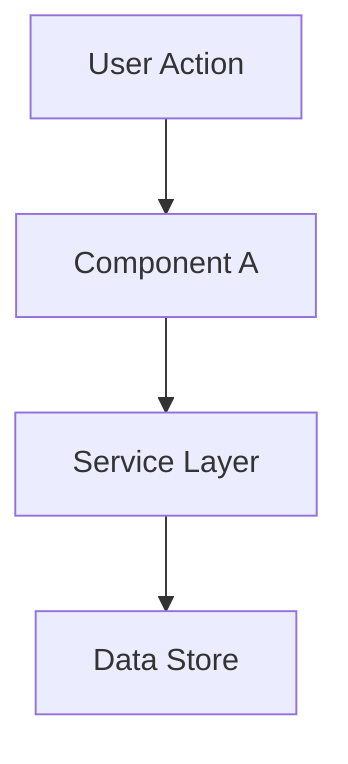

# [Feature] Design

**Spec:** `.specs/features/[feature]/spec.md`
**Status:** Draft
**Versao:** 0.1
**Data:** YYYY-MM-DD

---

## Architecture Overview

[Descricao breve. Mermaid quando ajuda.]

---

## Code Reuse Analysis

### Componentes existentes a aproveitar

| Componente | Localizacao | Como usar |
|---|---|---|
| | | |

### Pontos de integracao

| Sistema | Metodo |
|---|---|
| | |

---

## Components

### [Component Name]

- **Proposito:** [uma frase]
- **Localizacao:** `path` ou `schema.objeto`
- **Stack:**
- **Interfaces:**
- **Dependencias:**
- **Reutiliza:** [+ ADRs aplicaveis]

---

## Data Models (se aplicavel)

[interfaces TypeScript ou DDL Oracle]

---

## Estrategia de tratamento de erros

| Cenario | Tratamento | Impacto no usuario |
|---|---|---|
| | | |

---

## Estrategia de verificacao

> Declarada por componente para alimentar a fase Tasks ([ADR-013](../../adr/013-modelo-testes-co-localizado-por-task.md)).
> Aponta o **Approach esperado** (automated / manual / hybrid / none), o **tooling** que sera
> usado e o **artifact path** que o `hap-sd-tasks` espera ver em `Tests Artifact` no `tasks.md`.

| Componente | Approach | Tooling | Artifact path em `.specs/features/[feature]/tests/` |
|---|---|---|---|
| [ex: UserService] | automated | JUnit 5 + Mockito | `UserServiceTest.java` |
| [ex: Tela cadastro Forms] | manual | Procedimento documentado | `procedimento_cadastro.md` |
| [ex: package PKG_X PL/SQL] | automated | Script `.sql` via MCP Oracle | `verifica_pkg_x.sql` |
| [ex: DTO de request] | none | — | `N/A` (sem mudanca de comportamento) |

Alinhar com `TESTING.md` do squad ([REF: brownfield-mapping](../../references/brownfield-mapping.md)).
Quando aprovado, este mapa alimenta diretamente os campos `Tests Approach` e `Tests Artifact`
de cada task.

---

## Decisoes tecnicas (so as nao-obvias)

| Decisao | Escolha | Racional | ADR |
|---|---|---|---|
| | | | `[REF: ADR-XX]` ou `[ADR-AUSENTE]` |

---

## ADRs aplicaveis

- `[REF: ADR-21]` - Linguagem Onipresente
- `[REF: ADR-XX]` -

---

## Pesquisa realizada (Knowledge Verification Chain)

| Topico | Step | Fonte | Confianca |
|---|---|---|---|
| | | | |
